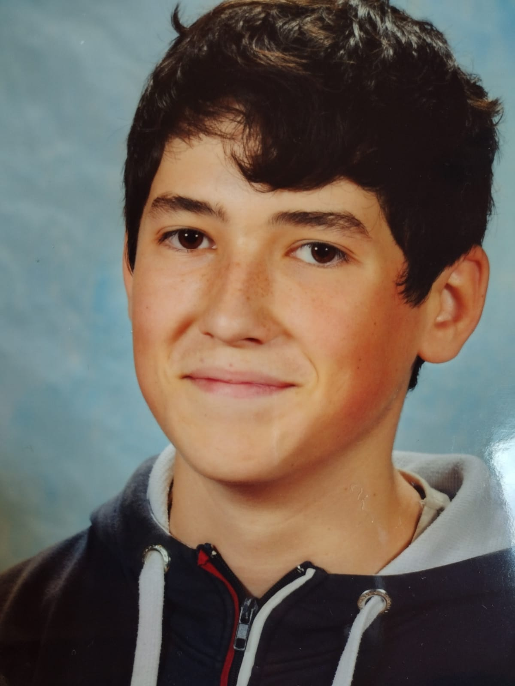
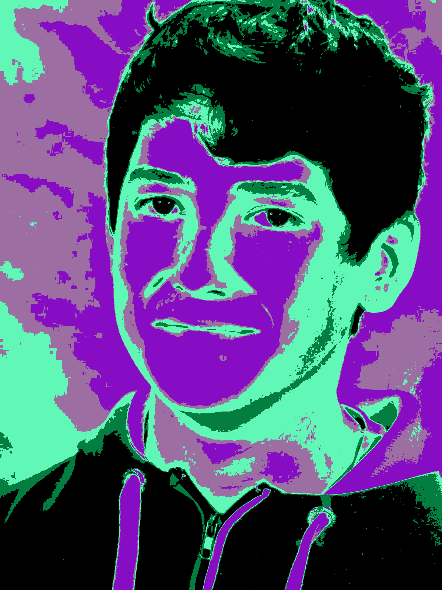
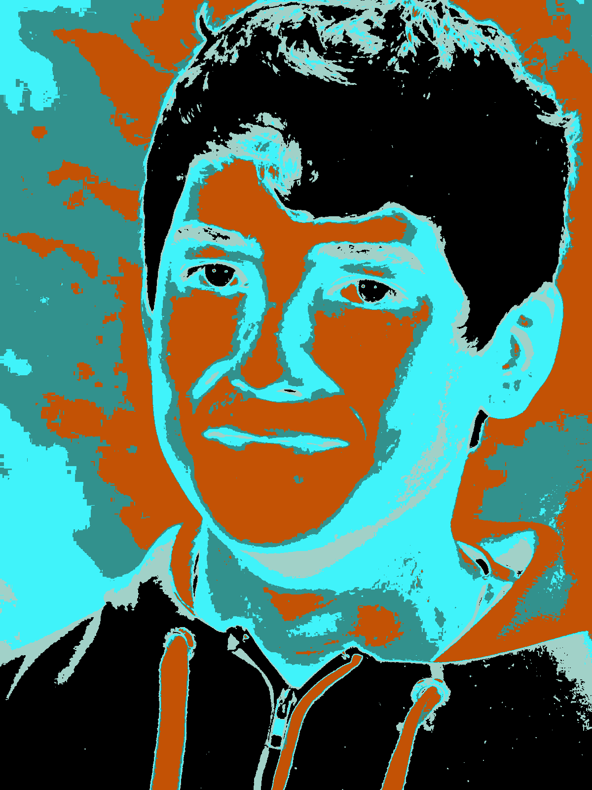

# Générateur de pop art

>Auteur: Raphaël Roumat

Projet personnel de génération de pop art en fonction d'une image de fournie par un utilisateur.

Bibliothèques utilisés:

- `SDL2`: Simple DirectMedia Layer, prémitives de gestion de fenêtres
- `SDL2_gfx` addon SDL pour graphiques basiques
- `SDL2_image` addon SDL pour faciliter le chargement d'images

## Méthode de génération:

L'utilisateur donne une image de départ et un nombre de couleurs à utiliser. L'image est mise en noir et blanc. On regroupe les pixels en fonction de leur teinte de gris dans autant de groupes que demande l'utilisateur. On attribue une couleur pour chaque groupe de manière aléatoire et on reconstitut l'image à partir des coordonnées de chaque pixel.

## Résultat

 |   Image de départ   |  Résultat   |   Résultat   |
 | :----: | :----: | :----: |
|  |   |  |
